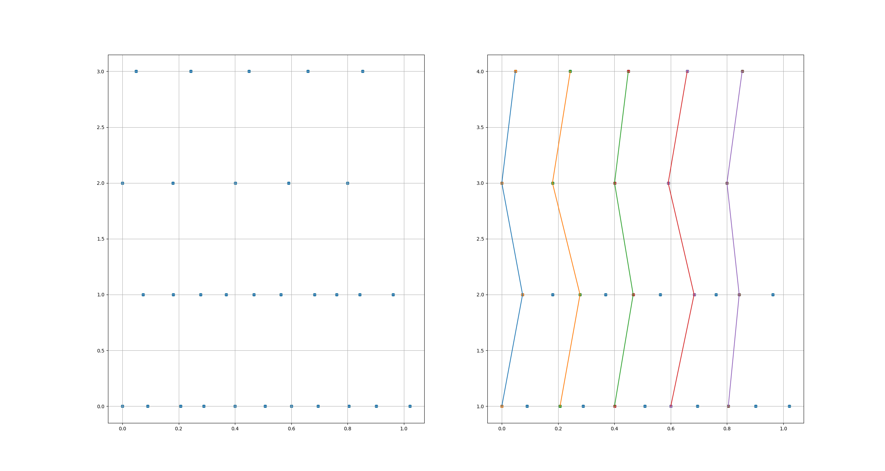

# StrobeSync Policy

## Overview
This project provides a custom synchronization policy for ROS that takes into account the time shift between different topics. It's designed to help synchronize messages from multiple topics while considering potential delays or shifts in their timestamps.

## Features
- Header-only library for easy integration
- Compatible with ROS message filters
- Built with modern C++ (C++17)

## Installation

### Prerequisites
- ROS (ROS2 not tested)
- CMake (version 3.5 or higher)
- Boost
- C++17 compatible compiler

### Building and Installing

1. Create a build directory and generate CMake instructions:
```bash
mkdir build && cd build
cmake ..
```

2. Install the library:
```bash
sudo make install
```

## Dirrect copy
Another option is to directly copy and use the strobe_sync_policy.hpp file in your project.
```cpp
#include "some/folder/strobe_sync_policy.hpp"
```

## Testing

To build tests do a certain steps from the root folder:

```bash
mkdir build && cd build
cmake .. -DBUILD_TESTS=ON
sudo make install
cmake --build .

ctest --test-dir tests --verbose
```

## Usage Example

```cpp
#include <ros/ros.h>
#include <sensor_msgs/Image.h>
#include <message_filters/synchronizer.h>
#include <message_filters/subscriber.h>
#include <strobe_sync_policy/strobe_sync_policy.hpp>

void callback(const sensor_msgs::ImageConstPtr &, const sensor_msgs::ImageConstPtr &)
{
    ROS_INFO("Received synchronized messages");
}

int main(int argc, char **argv)
{
    ros::init(argc, argv, "strobe_sync_example");
    ros::NodeHandle nh;

    message_filters::Subscriber<sensor_msgs::Image> sub1(nh, "/topic1", 1);
    message_filters::Subscriber<sensor_msgs::Image> sub2(nh, "/topic2", 1);

    typedef message_filters::evo_sync_policies::StrobeSync<sensor_msgs::Image, sensor_msgs::Image> SyncPolicy;
    message_filters::Synchronizer<SyncPolicy> sync(SyncPolicy({0., 1.}, 2., .5), sub1, sub2);
    sync.registerCallback(boost::bind(&callback, _1, _2));

    ros::spin();

    return 0;
}
```

## Examples

Here are some visual examples demonstrating the StrobeSync policy in action:

### Example 1

f1 = 10hz, f2 = 10hz, f3 = 5hz, f4 = 5hz  
s1 = 0, s2 = 0.07, s3 = 0, s4 = 0.05



### Example 2

f1 = 5hz, f2 = 5hz  
s1 = 0, s2 = 0.1
At 0.5 seconds, the third topic is interrupted


### Example 3

f1 = 10hz, f2 = 10hz, f3 = 5hz, f4 = 5hz  
s1 = 0.2, s2 = 0, s3 = 0.1, s4 = 0


### Example 4

f1 = 10hz, f2 = 10hz, f3 = 10hz  
s1 = 0, s2 = 1, s3 = 0


### Example 5

f1 = 10hz, f2 = 10hz, f3 = 5hz, f4 = 5hz (it might seem that I really like these values)  
s1 = 0, s2 = 0.07, s3 = 0, s4 = 0.05  

In this experiment, we simulate point-wise message loss


### Example 6

f1 = 10hz, f2 = 10hz, f3 = 10hz  
s1 = 0, s2 = 1, s3 = 0  

In this experiment, in addition to the known shift, messages themselves start publishing later

 
